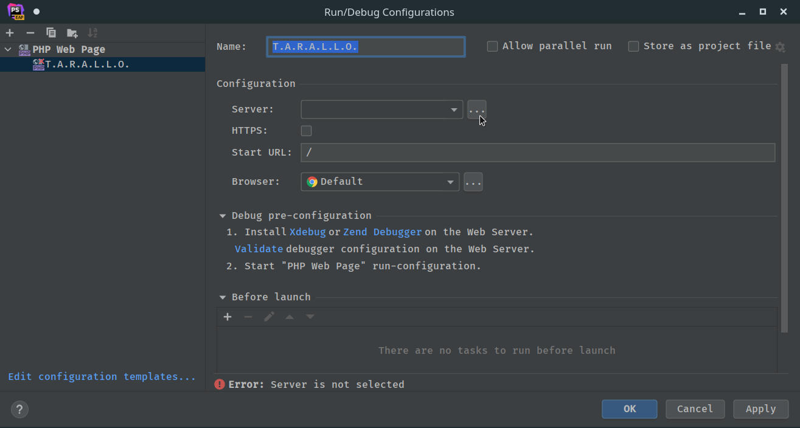
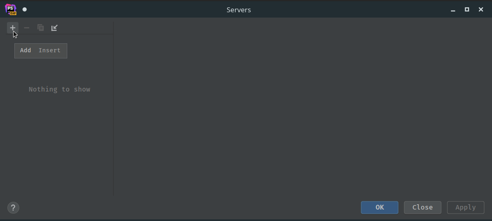

# Using Xdebug with docker-compose

To use debug with the `docker-compose` development environment, some extra steps are required.

### Create a new configuration

If you have never added a configuration to PHPStorm, click on the `Add configuration...` button on the top-right of the main window.  

If you have already added a configuration, click on the configurations drop-down and click on `Edit configurations...`.

### Add a new PHP Web Page

In the window that opens, click on the `+` button at the top-left and then select `PHP Web Page` from the drop-down

### Configure the web page

In the right pane, choose a name for the configuration (the name is not important), then click on the `...` to the right of the `Server` field under the `Configuration` section.

### Create a new server configuration

In the window that opens, click on the `+` button at the top-left of the page

Then on the right pane, give a name to the server (the name is no important) and configure the host as follows:
- Host: `127.0.0.1`
- Port: `8080`
- Debugger: `Xdebug`

Then tick the `Use path mappings` box and add the following mappings:
- public: `/var/www/html/public`
- src: `/var/www/html/src`
- tests: `/var/www/html/tests`

