# Running tests with PHPStorm

## Setup
To run tests with the `docker-compose` development environment, some extra steps are required.

## Create a new configuration from the `Run/Debug configurations menu`
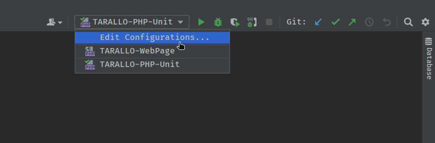

## Add a new PHPUnit configuration

In the window that opens, click on the `+` in the top-left corner and click on `PHPUnit` in the dropdown.

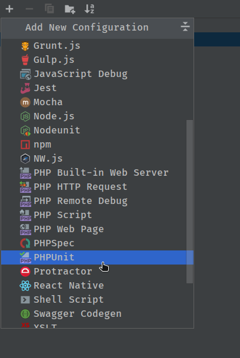

## Setup PHPUnit with `docker-compose`

Choose a name for your configuration, choose `Defined in the configuration file` as `Test scope` under `Test Runner`, then click on the gear to the right of the first text field as indicated in the picture.

> **NOTE:** Do **not** select the `Use alternative configuration file` box.

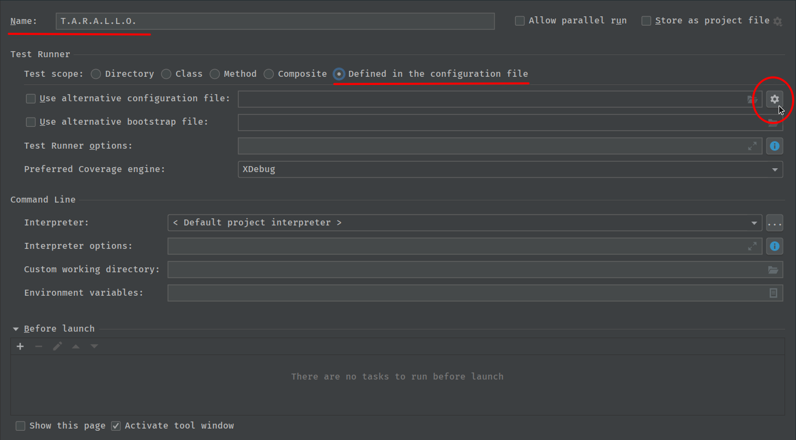

## Create a CLI interpreter

In the window that opens click on the `+` in the top-left corner and click on `PHPUnit by Remote Interpreter`.

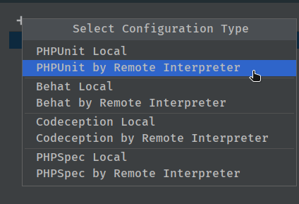

In the window that opens click on the `...` to the right of the drop-down menu.

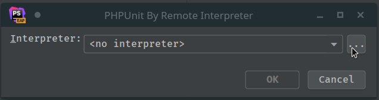

In the window that opens click on the `+` in  the top-left corner and click on `From Docker, Vagrant, VM, WSL, Remote...`.

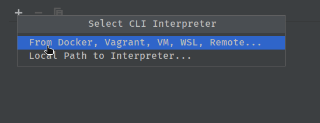

In the window that opens select `Docker Compose` as a runner and click on `New...` to the right of the server field.

Select a name for the test server. If your docker daemon is running (it should!) PHPStorm should be able to detect it automatically, otherwise you have to configure it yourself. How to connect to the docker daemon varies from OS and installation. In this case, [Duck Duck Go is your friend](https://duckduckgo.com/).

When you see "Connection successful" in the bottom half of the window, the connection is successfull and you can click OK.

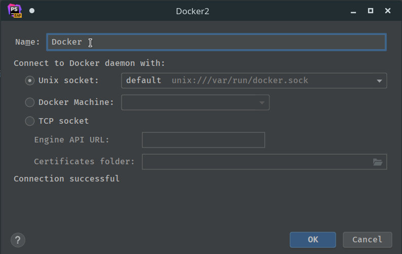

Make sure the value of the `Configuration files` is set to `./docker-compose.yml` (it should by default) and select `app` from the `Service` drop-down menu.

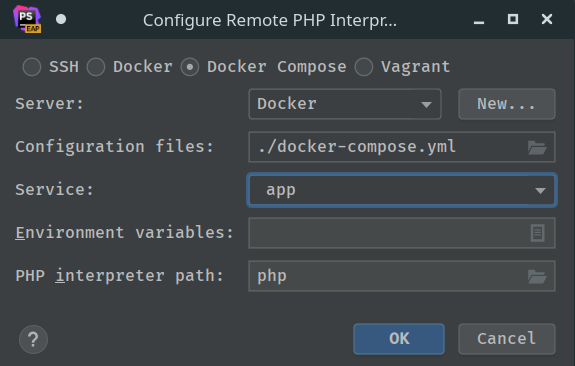

Under `Lifecycle` select `Connect to existing container`. Under `General` make sure that the system correctly identifies that PHPStorm detects correctly PHP and XDebug installations in the container and click OK.

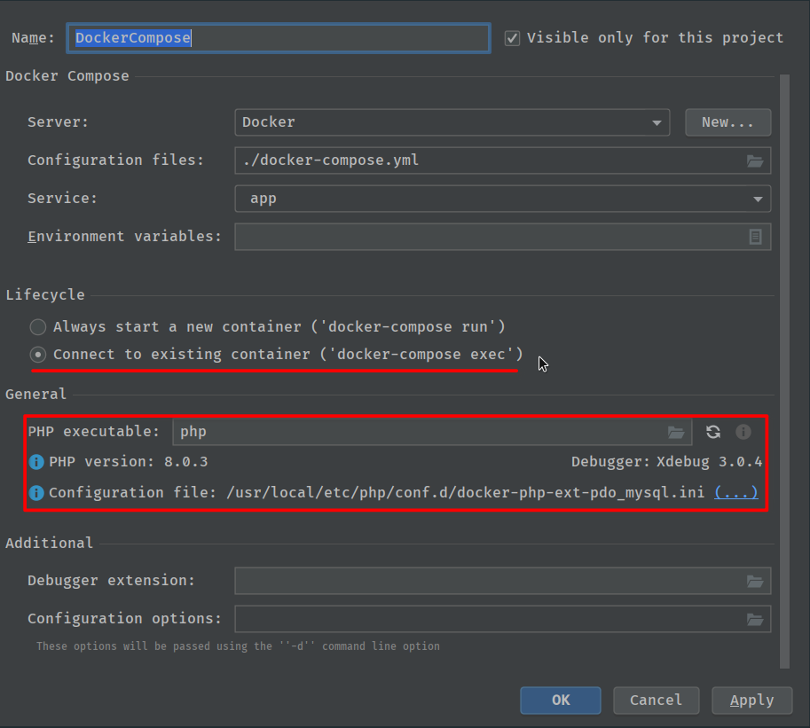

Select the interpreter you just created in the previous step from the drop-down and click OK.

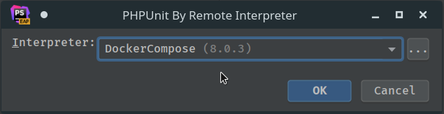

Click on the folder icon inside the `Path mappings` field, to the right.

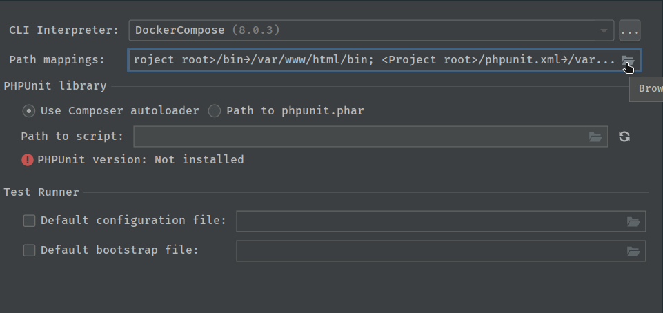

Make sure that the path mappings have been correctly identified and added. If not, add them (using the `+` button in the top-left) or edit them to match the ones shown below and then press OK.

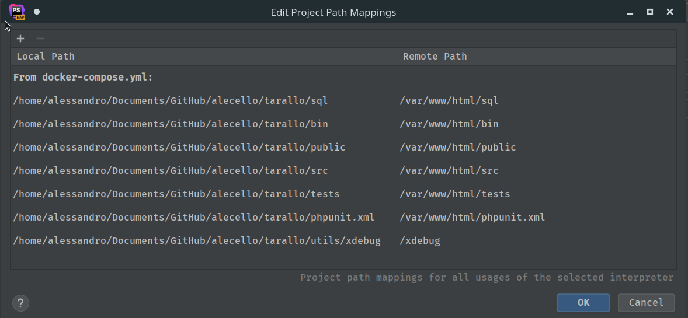

Inside the `PHPUnit library` section select `Use Composer autoloader` and write `/var/www/html/vendor/autoloader.php` in the `Path to script` field, then click the refresh button to the right of that same field and make sure that PHPStorm correctly identifies the container's PHPUnit installation.

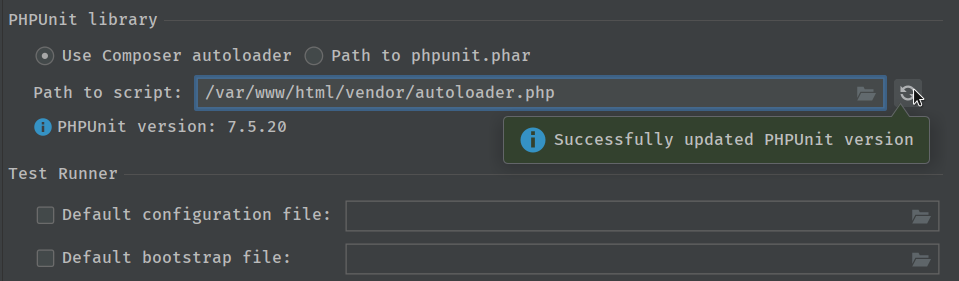

Under `Test Runner` tick the `Default configuration file` box and write `phpunit.xml` in the text field to the right and press OK.

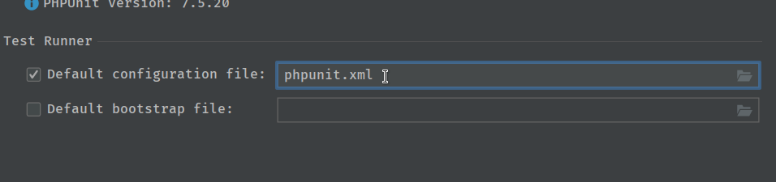

Under the `Command Line` section select the newly created interpreter under the `Interpreter` drop-down.

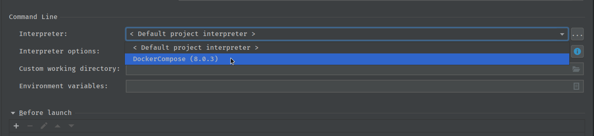

## Run tests

Make sure to select the test configuration from the `Run/Debug configurations` drop-down.

You can use these three buttons to run your tests. In order from left to right:

- `Run tests`: run the tests normally and report on their results
- `Run tests in debug mode`: like the above, but also enable debugging during the run
- `Coverage`: run coverage tests on top of the tests

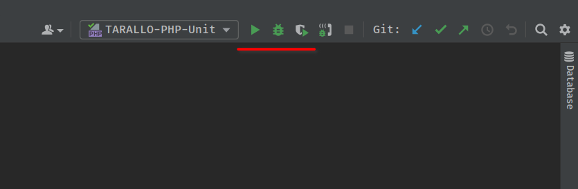